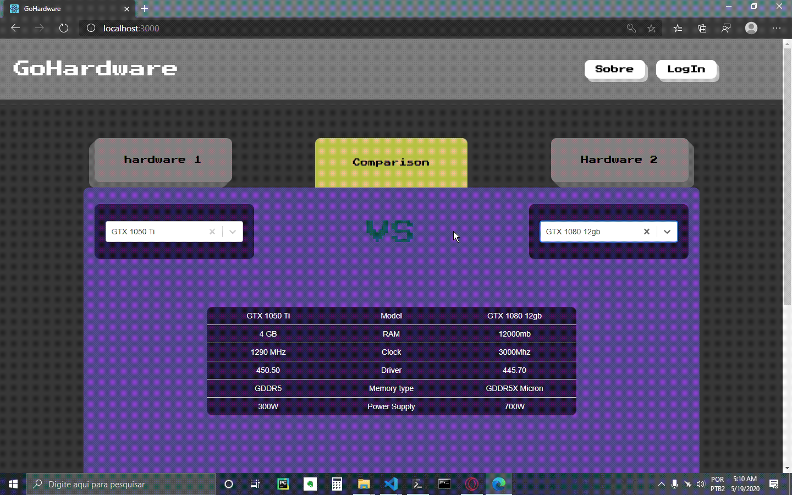

This project was bootstrapped with [Create React App](https://github.com/facebook/create-react-app).

# GoHardware Web Application.

This is a concept app made to compare different types and models of hardwares available on the market.

## Functionalities available

The main goal of the app is comparison between hardwares, the login authentication, database data insertion and profile page, are just made to give the project some complexity level.

## Home Page ( Comparison functionality )

## Login Page ( Login authentication )

